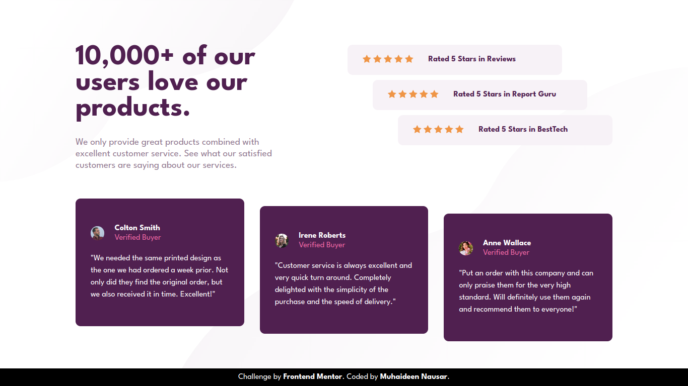

# Frontend Mentor Challenge - Social Proof Section (Desktop Version)

## Challenge Description

This repository contains my solution to the "Social Proof Section" challenge on Frontend Mentor. The challenge is to build a responsive social proof section for the desktop version of a website. The design provided by Frontend Mentor includes user reviews and ratings that need to be displayed in an organized and visually appealing manner.

The challenge focuses on HTML and CSS to create a visually appealing layout while ensuring that the design is responsive for desktop screens.

## Preview

## Demo

You can view the live demo of my solution here: [**Social Proof Section Demo**]()

## Technologies Used

* HTML
* CSS

## Features

* Responsive design for desktop screens.
* User reviews and ratings displayed in a visually appealing manner.
* Clean and organized HTML and CSS code.

## Credits

* Challenge by [**Frontend Mentor**](https://frontendmentor.io/)
* Design provided by Frontend Mentor